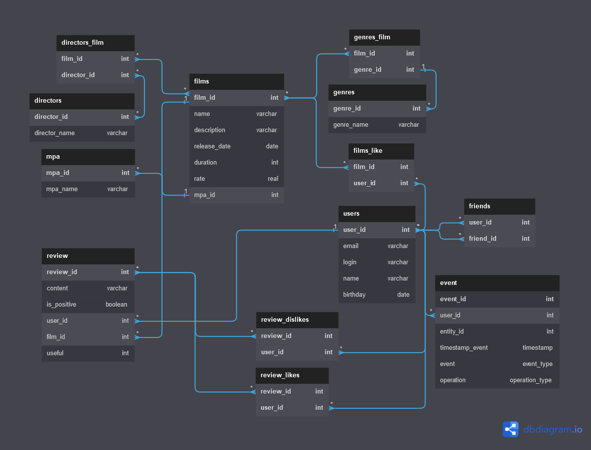

# java-filmorate

Схема БД для проекта filmorate.

- База нормализована.
- В промежуточных таблицах primary key составной из двух полей.
- Приложен скрипт тестирования Postman.

**Особенности проекта:**

**1) CRUD операции с фильмами и пользователями, а Read операции с MPA и жанрами.**

**2) Функциональность «Рекомендации».**

Простая рекомендательная система для фильмов.
### API
`GET /users/{id}/recommendations`
Возвращает рекомендации по фильмам для просмотра.

**3) Функциональность «Поиск».**

Поиск по названию фильмов и по режиссёру. Алгоритм умеет искать по подстроке.
### API
`GET /fimls/search`
Возвращает список фильмов, отсортированных по популярности.

**Пример**

`GET /films/search?query=крад&by=director,title`

`query` — текст для поиска

`by` — может принимать значения `director` (поиск по режиссёру), `title` (поиск по названию), либо оба значения через запятую при поиске одновременно и по режиссеру и по названию.

**4) Функциональность «Лента событий».**

Возможность просмотра последних событий на платформе — добавление в друзья, удаление из друзей, лайки и отзывы,
которые оставили друзья пользователя.
### API
`GET /users/{id}/feed`
Возвращает ленту событий пользователя.

**5) Функциональность «Отзывы».**

Отзывы на фильмы. Отзывы сортируются по рейтингу полезности.

### API

`POST /reviews`
Добавление нового отзыва.

`PUT /reviews`
Редактирование уже имеющегося отзыва.

`DELETE /reviews/{id}`
Удаление уже имеющегося отзыва.

`GET /reviews/{id}`
Получение отзыва по идентификатору.

`GET /reviews?filmId={filmId}&count={count}`
Получение всех отзывов по идентификатору фильма, если фильм не указан то все. Если кол-во не указано то 10.

- `PUT /reviews/{id}/like/{userId}`  — пользователь ставит лайк отзыву.
- `PUT /reviews/{id}/dislike/{userId}`  — пользователь ставит дизлайк отзыву.
- `DELETE /reviews/{id}/like/{userId}`  — пользователь удаляет лайк отзыву.
- `DELETE /reviews/{id}/dislike/{userId}`  — пользователь удаляет дизлайк отзыву.

**6) Функциональность «Общие фильмы».**

Вывод общих с другом фильмов с сортировкой по их популярности.
### API

`GET /films/common?userId={userId}&friendId={friendId}`
Возвращает список фильмов, отсортированных по популярности.

**Параметры**

`userId` — идентификатор пользователя, запрашивающего информацию;

`friendId` — идентификатор пользователя, с которым необходимо сравнить список фильмов.

**7) Режиссёры в фильмах.**

- Вывод всех фильмов режиссёра, отсортированных по количеству лайков.
- Вывод всех фильмов режиссёра, отсортированных по годам.

### API
`GET /films/director/{directorId}?sortBy=[year,likes]`
Возвращает список фильмов режиссера отсортированных по количеству лайков или году выпуска.

`GET /directors` - Список всех режиссёров

`GET /directors/{id}`- Получение режиссёра по id

`POST /directors` - Создание режиссёра

`PUT /directors` - Изменение режиссёра

`DELETE /directors/{id}` - Удаление режиссёра

**8) Вывод самых популярных фильмов по жанру и годам.**

Возможность выводить топ-N фильмов по количеству лайков. 
Фильтрация по двум параметрам:
- По жанру. 
- За указанный год.
### API
`GET /films/popular?count={limit}&genreId={genreId}&year={year}`
Возвращает список самых популярных фильмов указанного жанра за нужный год.
